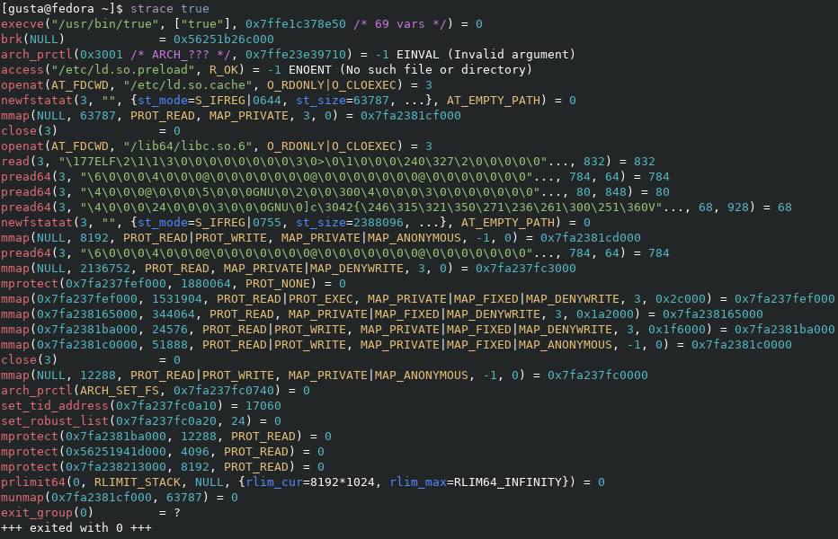

# strace, but with colors

This patch adds colored output to the [strace](https://strace.io/) program.

## The `--color` option

From `strace --help`

```text
  --color[=WHEN]
                 colorize the output; WHEN can be 'always', 'auto' (default), or 'never'
```

+ `always` will always colorize the output
+ `never` will never colorize the output
+ `auto` will only colorize the output when standard output is connected to a terminal and `--output` is not used.

Setting the `NO_COLOR` environment variable will disable the colored output.

## Installation

### Arch Linux

[**strace-with-colors**](https://aur.archlinux.org/packages/strace-with-colors) package from AUR

```text
git clone https://aur.archlinux.org/strace-with-colors.git
cd strace-with-colors
makepkg -si
```

### Fedora Linux

[**strace-with-colors**](https://copr.fedorainfracloud.org/coprs/xfgusta/strace-with-colors/) package from Copr

```text
dnf copr enable xfgusta/strace-with-colors
dnf install strace-with-colors
```

### From source

Clone the [strace git repository](https://github.com/strace/strace) and go to the directory

```text
git clone https://github.com/strace/strace
cd strace
```

Checkout the tag `v6.16` (latest version)

```text
git checkout tags/v6.16
```

Get the patch source [here](https://github.com/xfgusta/strace-with-colors) and apply it

```text
curl -O https://raw.githubusercontent.com/xfgusta/strace-with-colors/main/strace-with-colors.patch
git apply strace-with-colors.patch
```

Now you are ready to build and install strace with colors!

```text
./bootstrap
./configure --enable-mpers=no
make install
```

You may need to install some dependencies before, like:

+ `make`
+ `autoconf`
+ `automake`
+ `gcc`
+ ...

You can actually check all the strace installation instructions [here](https://github.com/strace/strace/blob/master/README-configure).

The program will be in the `/usr/local/bin` directory. You can uninstall it running `make uninstall`.

## Screenshot



### Color scheme

Here is the color scheme used in the screenshot above:

| FG | Name    | Color     |
| -- | ------- | --------- |
| 0  | Black   | `#2d3139` |
| 1  | Red     | `#e06c75` |
| 2  | Green   | `#98c379` |
| 3  | Yellow  | `#e5c07b` |
| 4  | Blue    | `#528bff` |
| 5  | Magenta | `#c678dd` |
| 6  | Cyan    | `#56b6c2` |
| 7  | White   | `#d7dae0` |
